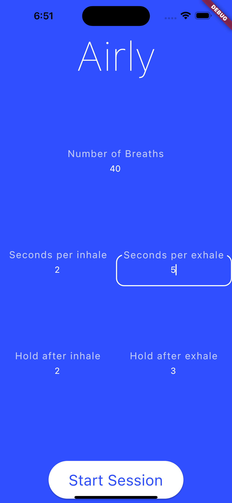

# airly

This is a breathing app, which let's you customize your breathing practise. From Box Breathing to a
lot of other kinds of breath work, you can create your own protocols.

It is programmed using flutter and is primarily developed for mobile phones.

## Screenshots

## Installation

[Flutter Installation Guide](https://docs.flutter.dev/get-started/install)
